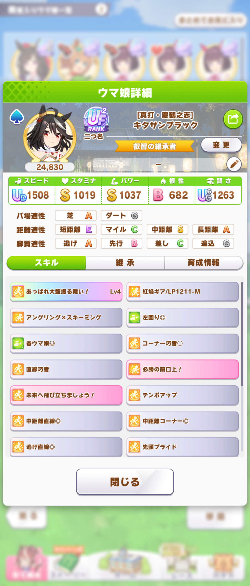

某ツールが残念ながら公開停止してしまったので開発再開しました。

# uma-join: ウマのステータス画像を結合するツール

こちら→ https://amay077.github.io/uma-join/#/

  
  

## 使い方

1. 「画像を追加」で2枚以上の画像を追加します。ファイル名の昇順に追加されます。追加後、ドラッグして順序を並び替えることができます。画像を上から結合したい順になるようにしてください。
2. 「連結!!」を押します。
3. しばらく待つと 結果 に結合された画像が表示されます。期待通りなら「ダウンロード」を押して画像を保存してください。

## 結合例

### 1. ステータス画面

<table>
  <tr><th>入力</th><th>結果</th></tr>
  <tr>
    <td>
        
        
    </td>
    <td>
      
    </td>
  </tr>
</table>

### 2. 因子画面

<table>
  <tr><th>入力</th><th>結果</th></tr>
  <tr>
    <td>
        
        
        
        
    </td>
    <td>
      
    </td>
  </tr>
</table>

### 3. レース出走画面

<table>
  <tr><th>入力</th><th>結果</th></tr>
  <tr>
    <td>
        
        
        
        
        
        
        
        
    </td>
    <td>
      
    </td>
  </tr>
</table>

## 期待した結合結果が得られない場合

1. 「経過を表示」を押すと、結合処理過程の画像群が表示されます。
2. うまく結合できない原因の多くは「3. テンプレート領域」と「4. テンプレートマッチング結果」が一致していないです。その場合、「詳細設定」を ON にして、Y位置 や 高さ を少しずつ変更して、再度、途中経過を確認してみてください。

途中経過が表示できない、設定をいろいろ変更したが期待した結果が得られない場合は [Issues](https://github.com/amay077/uma-join/issues) へ報告してください。
その際、

1. 実際に入力した画像群
2. 詳細設定の設定値
3. 実行環境(ブラウザ名、パソコン or スマホ、スマホの場合機種名)
4. このアプリのバージョン

などをお知らせください。

end of contents.
